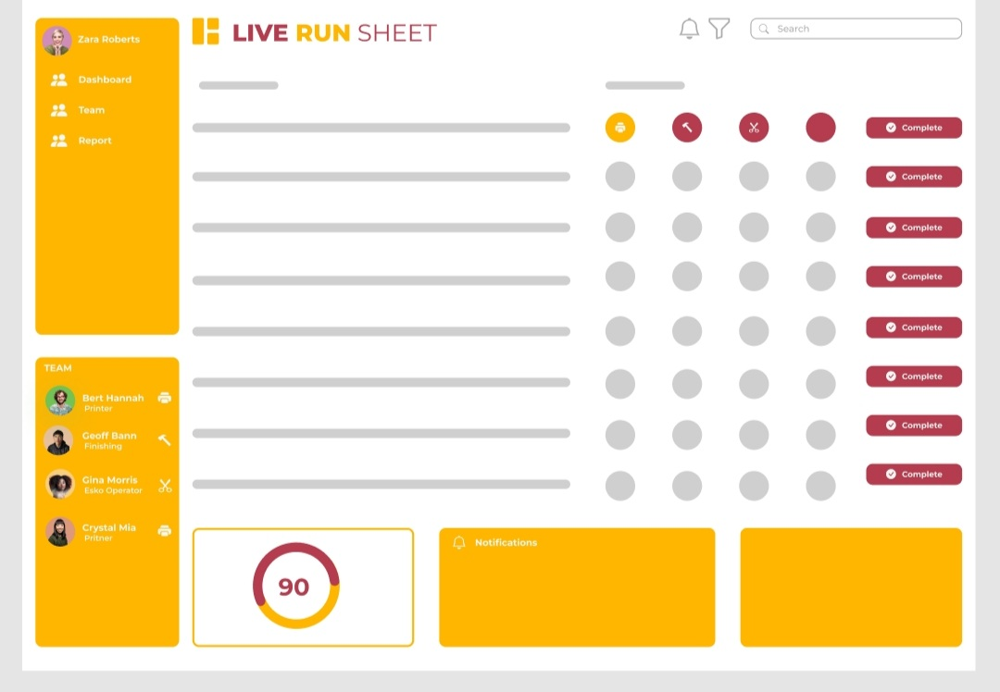

[![Contributors][contributors-shield]][contributors-url]
[![Forks][forks-shield]][forks-url]
[![Stargazers][stars-shield]][stars-url]
[![Issues][issues-shield]][issues-url]
[![MIT License][license-shield]][license-url]

<!-- PROJECT LOGO -->

  

<h3 align="center">LIVE RUN SHEET</h3>

  

    The Live Run Sheet is a web-based Dashbard that can be used by a Production Manager to track daily jobs and tasks in real-time. 
     
    <a href="https://github.com/github_skenzler/live_run_sheet"><strong>Explore the docs »</strong></a>
     
     
    <a href="https://github.com/github_skenzler/repo_name">View Demo</a>
    ·
    <a href="https://github.com/github_skenzler/live_run_sheet/issues">Report Bug</a>
    ·
    <a href="https://github.com/github_username/repo_name/issues">Request Feature</a>
  

<!-- TABLE OF CONTENTS -->

  
Table of Contents

  <ol>
    <li>
      <a href="#about-the-project">About The Project</a>
      <ul>
        <li><a href="#built-with">Built With</a></li>
      </ul>
    </li>
    <li>
      <a href="#getting-started">Getting Started</a>
      <ul>
        <li><a href="#prerequisites">Prerequisites</a></li>
        <li><a href="#installation">Installation</a></li>
      </ul>
    </li>
    <li><a href="#usage">Usage</a></li>
    <li><a href="#roadmap">Roadmap</a></li>
    <li><a href="#contributing">Contributing</a></li>
    <li><a href="#license">License</a></li>
    <li><a href="#contact">Contact</a></li>
    <li><a href="#acknowledgments">Acknowledgments</a></li>
  </ol>

<!-- ABOUT THE PROJECT -->
## About The Project

(<a href="#top">back to top</a>)

### Built With
* [HTML5](https://html.com/html5)
* [CSS3](https://www.w3.org/)
* [JavaScript](https://www.javascript.com)

(<a href="#top">back to top</a>)

<!-- CONTRIBUTING -->
## Contributing

Contributions are what make the open source community such an amazing place to learn, inspire, and create. Any contributions you make are **greatly appreciated**.

If you have a suggestion that would make this better, please fork the repo and create a pull request. You can also simply open an issue with the tag "enhancement".
Don't forget to give the project a star! Thanks again!

1. Fork the Project
2. Create your Feature Branch (`git checkout -b feature/AmazingFeature`)
3. Commit your Changes (`git commit -m 'Add some AmazingFeature'`)
4. Push to the Branch (`git push origin feature/AmazingFeature`)
5. Open a Pull Request

(<a href="#top">back to top</a>)

<!-- LICENSE -->
## License

Distributed under the MIT License. See `LICENSE.txt` for more information.

(<a href="#top">back to top</a>)

<!-- CONTACT -->
## Contact
1. Shane Kenzler - shanekenzler@gmail.com

(<a href="#top">back to top</a>)

<!-- ACKNOWLEDGMENTS -->
## Acknowledgments

* [Github](https://github.com)
* [Figma](https://www.figma.com)
* [VS Code](https://code.visualstudio.com)

(<a href="#top">back to top</a>)

<!-- MARKDOWN LINKS & IMAGES -->
<!-- https://www.markdownguide.org/basic-syntax/#reference-style-links -->
[contributors-shield]: https://img.shields.io/github/contributors/Stiltskinner/Pig-E-Bank.svg?style=for-the-badge
[contributors-url]: https://github.com/SKenzler/Live-Run-Sheet/graphs/contributors
[forks-shield]: https://img.shields.io/github/forks/Stiltskinner/Pig-E-Bank.svg?style=for-the-badge
[forks-url]: https://github.com/SKenzler/Live-Run-Sheet/network/members
[stars-shield]: https://img.shields.io/github/stars/Stiltskinner/Pig-E-Bank.svg?style=for-the-badge
[stars-url]: https://github.com/SKenzler/Live-Run-Sheet/stargazers
[issues-shield]: https://img.shields.io/github/issues/Stiltskinner/Pig-E-Bank.svg?style=for-the-badge
[issues-url]: https://github.com/SKenzler/Live-Run-Sheet/issues
[license-shield]: https://img.shields.io/github/license/Stiltskinner/Pig-E-Bank.svg?style=for-the-badge
[license-url]: https://github.com/SKenzler/Live-Run-Sheetk/blob/master/LICENSE.txt

[product-screenshot]: images/screenshot.png
